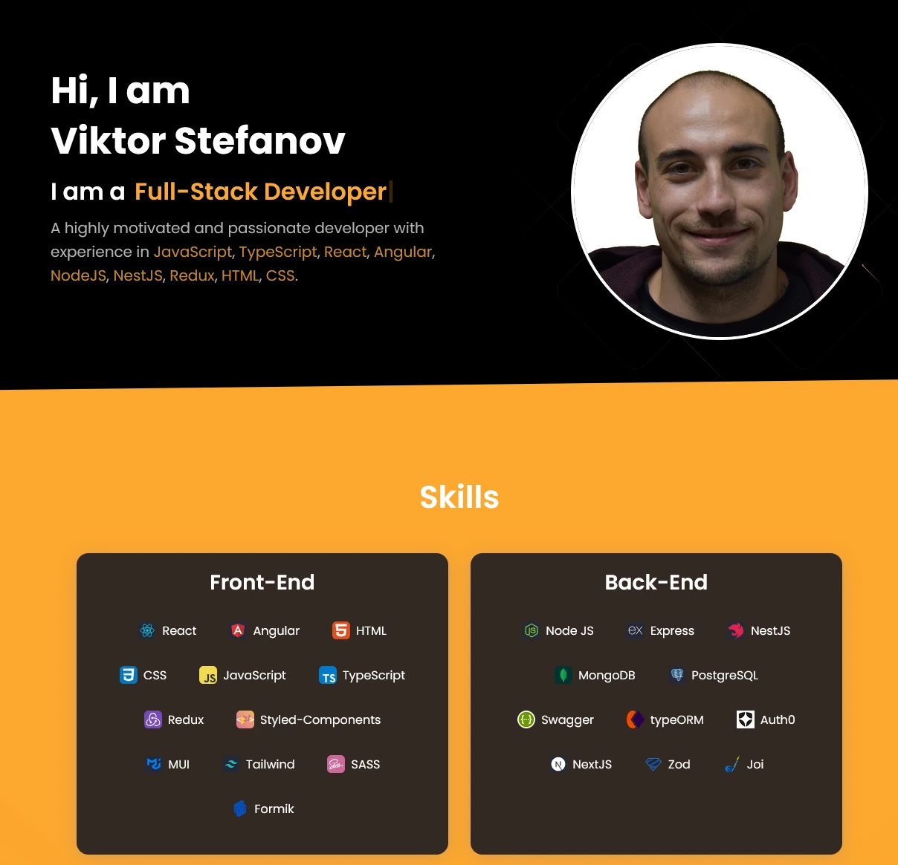

## This is my redesigned developer portfolio, rebuilt from scratch to reflect my growth as a developer. It highlights modern practices, improved architecture, and a polished user experience.

## About

My previous portfolio was created early in my dev journey with JavaScript. Since then, I've gained extensive experience and adopted industry best practices. This project demonstrates my current skills and approach to building scalable, interactive, and responsive web applications.

## Tech Stack

- **Frontend Framework**: React
- **Language**: TypeScript
- **Styling**: Tailwind CSS
- **Animations**: Framer Motion, Typewriter Effect
- **Utilities**: React Icons, React Scroll, React YouTube

## Features

- Responsive layout
- Smooth animations and interactive effects
- Scroll-based navigation and highlighting
- Typewriter effect
- YouTube video integration
- Modular and scalable architecture
- Clean, reusable, and component-driven design
- Built with small, maintainable, and reusable components for cleaner code and easier scalability
- Optimized images using WebP format for faster loading and smaller file sizes

## Installation

### 1. Clone the repository:

```bash
git clone https://github.com/viiktorstefanov/portfolio-v2.git
cd portfolio-v2
```

### 2. Edit example data 

```bash
Go to src/constants/example.data.ts 
Rename example.data.ts to data.ts
Update with your personal information
```

### 3. Install dependencies

```bash
npm install
```

### 4. Run the project 

```bash
npm run dev 
```